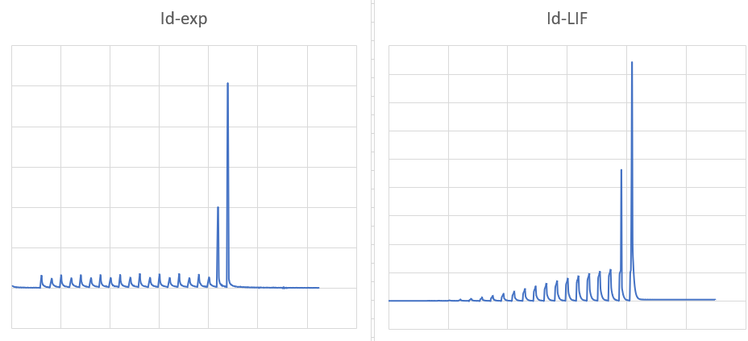

We tuned the LIF model until it matched the experimental data, and then we obtained the value of decay rate and threshold.

The LIF model: $V[t+1]=wX[t]+\beta V[t]-S[t]V_{th}$

The `decay_n_thres_matrix.csv` file is an example that we import the matrix into the neural network.

